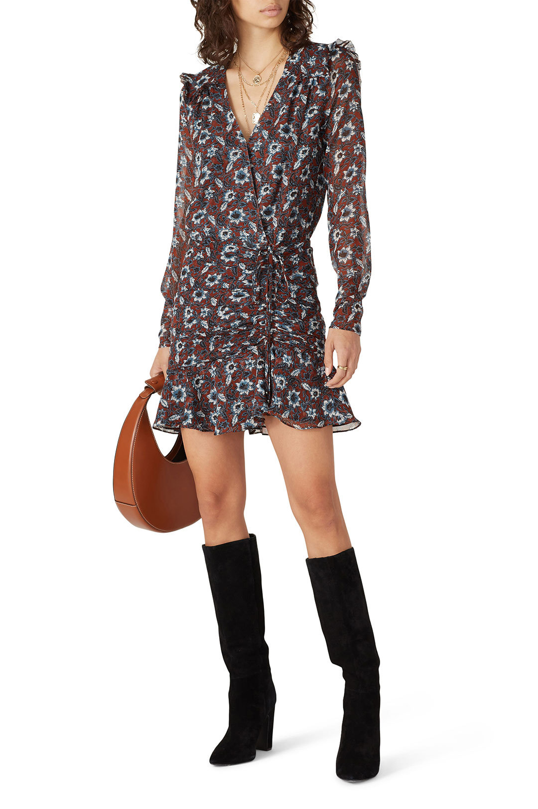
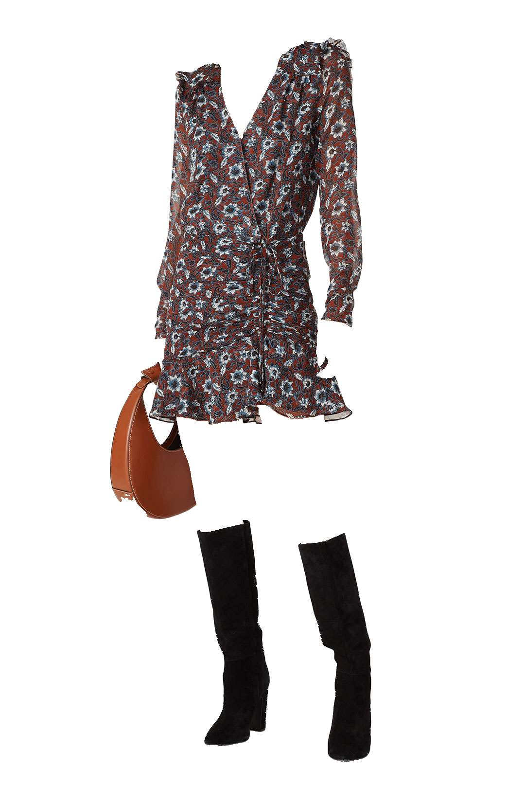

# Clothes Segmentation
This is my implementation of [this project](https://github.com/ternaus/cloths_segmentation)! 

## Dependencies
-   python >= 3.6 
-   [pytorch](https://pytorch.org/) >= 1.2
-   opencv
-   matplotlib
-   [RoiAlign](https://github.com/longcw/RoIAlign.pytorch)
-   albumentations, iglovikov_helper_functions, pytorch_lightning, pytorch_toolbelt, segmentation-models-pytorch, tqdm, wandb

## Installation
1. Download & install cuda 10.2 toolkit [here](https://developer.nvidia.com/cuda-10.2-download-archive?target_os=Linux&target_arch=x86_64&target_distro=Ubuntu&target_version=1804&target_type=debnetwork)
2. Download & install anaconda python 3.7 version 
3. Install Dependencies
4. Run `main.py`

## A example
{:width="50%"} {:width="50%"}

